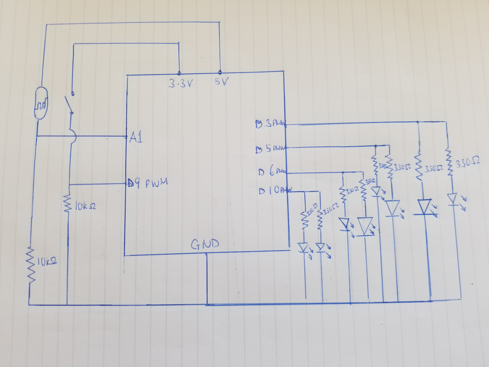
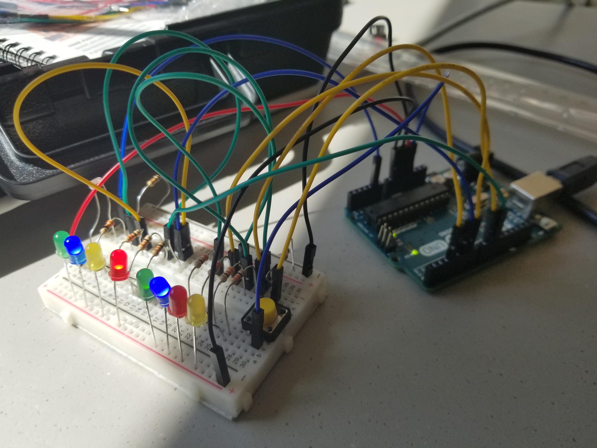

## PROJECT GOAL

The piece was meant to be an extension of the game I made in my last assignment. In this game the user is required to engage with analog and digital sensors to get all the lights to light up without flickering. I used a light sensitive resistor as my analog sensor and a switch as my digital sensor. I set up the conditions for the game so that once the user has brought the resistance from the light sensitive resistor to below a certain value while pressing the button then all the lights will light up. I thought this would be an interesting way to utilize natural elements in playing a game, in this case light, as opposed to an over reliance on logic and mobility that I see in most games today. I also thought it would create wider creative possibility where the user can think of many ways to obstruct light to bring the resistance down. 

## SCHEMATIC DIAGRAM

## PHOTO OF PROJECT

## LINK TO VIDEO OF PRJOCT WORKING

[Video link](https://drive.google.com/file/d/1YqxM47iUTfn-za6PQc6Ck6JEIbDclvc6/view?usp=sharing)

## DIFFICULTIES

The only difficulty was organization of the physical components. I found myself with a very confusing amount of wires and very little space. To address this I had to learn how to better organize my components on my bread board.
