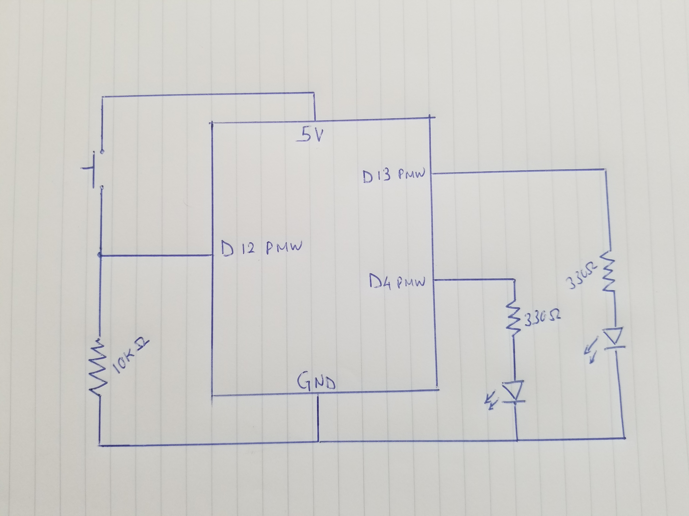
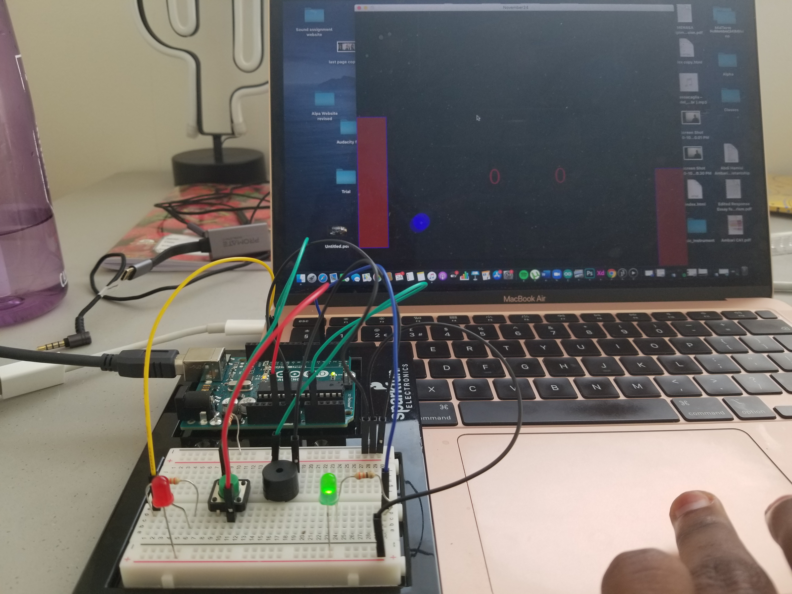
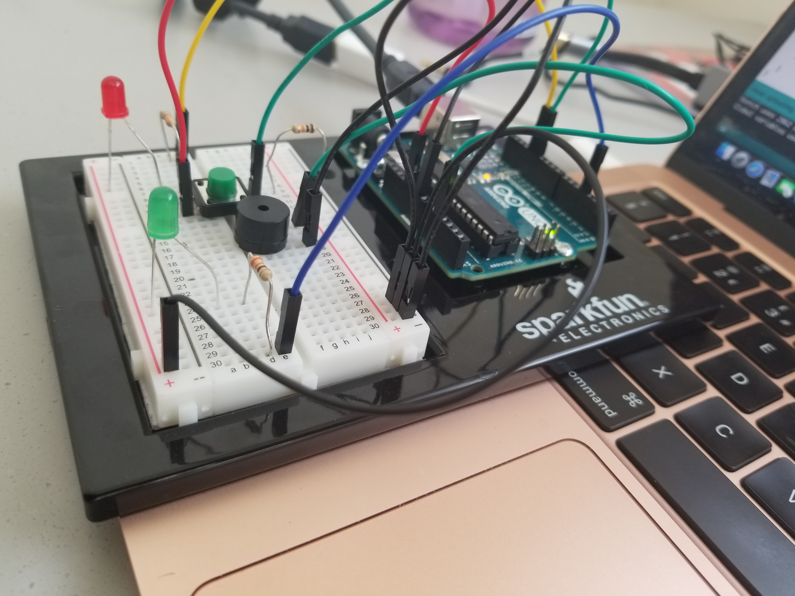
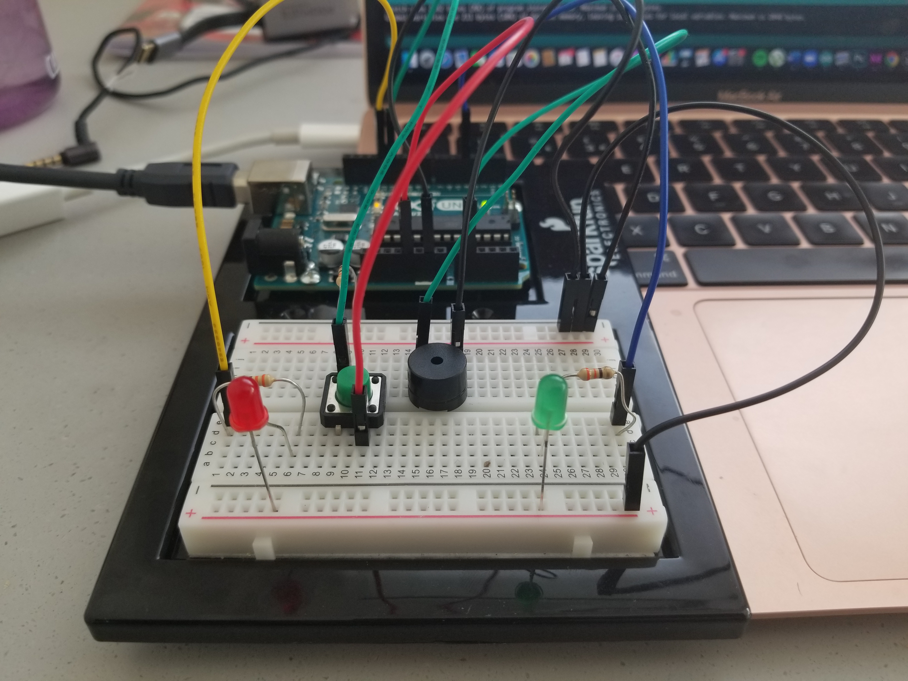
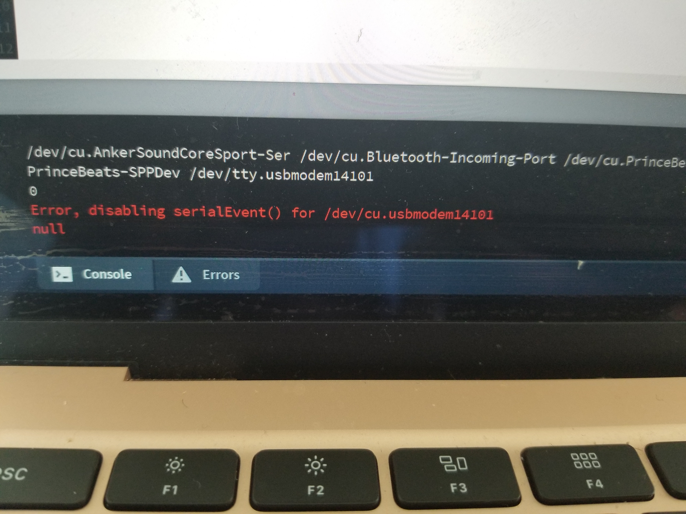

## PROJECT GOAL AND DESCRIPTION

The goal of the project was to encorporate sound and light effects to my air hockey game. I intended to signal when the ball has been hit by means of a green light and when it's been missed by means of a red light. The ball being missed is also to be accompanied by an annoying buzzing sound. I also encorporated a feature to restart the game by the push of a button. The restart game feature was inspired by me not being able to figure out how to restart the game without closing it and opening it again everytime the first time I tried to make the game. The game would send signals to Arduino pertaining the state of the ball prompting action in the LED lights and the buzzer while Arduino sent information about the state of the button to prompt the restarting of the game. 

## SCHEMATIC DIAGRAM

## PHOTOS OF SETUP 

## VIDEO SETUP

[Video of Instrument](https://drive.google.com/file/d/1dlSYjIAIFPArcoSybqpa6Kn6kV_Hx7Jo/view?usp=sharing)

## DIFFICULTIES

The difficulties I faced wer, firstly, the lag that exists when Arduino sends information to Processing. I couldn't use delay() method because that interfered with the timin of the buzzer and so I had to construct a a function that utilizes the mills() feature o stall Arduino for long enough for Processing to move at the same pace. Another problem was encountered when sending information to Processing that would prompt the game to restart. In the serialEvent function, whenever I created an if statement that would execute the restart() function I would always get the error attached below. I then had to ditch the restart fuction and manually add the attributes that constituted a restart into the if statement. Even then, the error would still appear sometimes.

