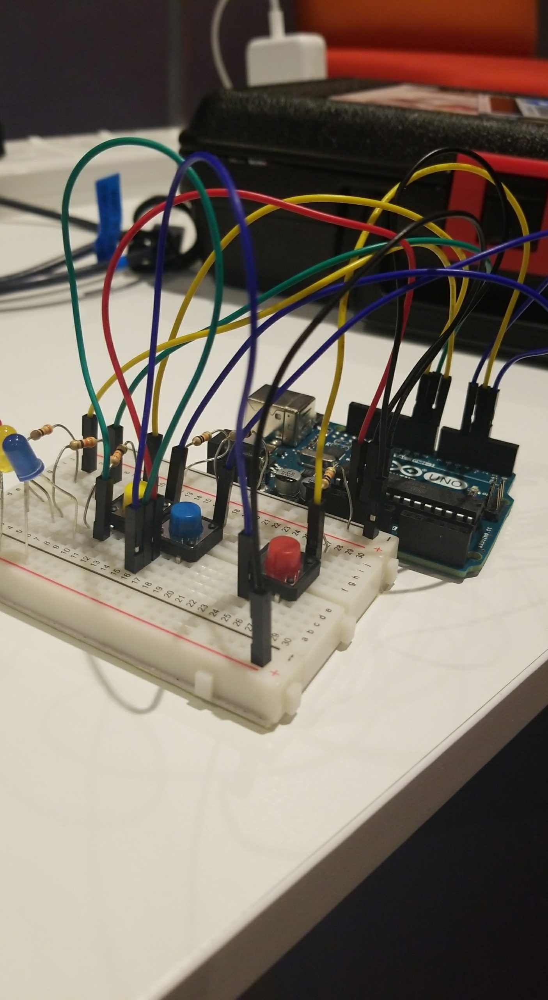
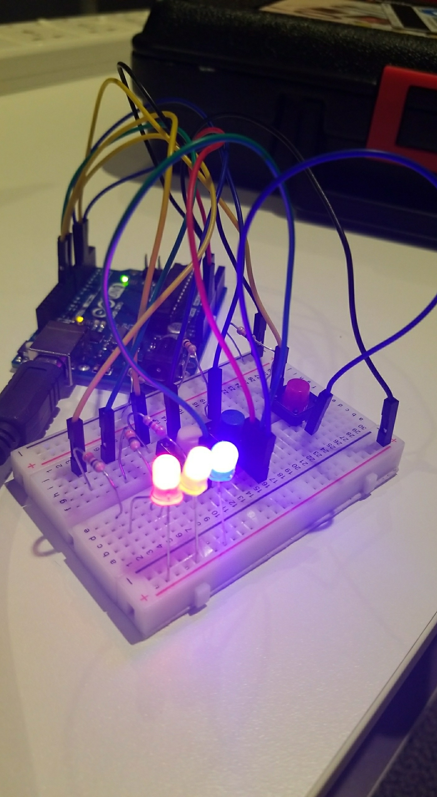

### PROCESS

The process became simple after revisiting the lecture and understanding exactly what DigitalReadSerial did since I didn't quite understand it in class. After that the execution of the puzzle was based on random decisions. I decided to make the objective of the game turning all the lights off at the same time and decided, randomly, to assign what combination of buttons would accomplish that. An interesting twist that I added to make the game more challenging was having the colors of the buttons not necessarily correspond to the colour of the lights at all times. Consequently, when a player presses a blue button that turns on the blue light, this information becomes useless once they start experimenting with button combinations adding a level of complexity to the game. 

##### SCHEMATIC DIAGRAM

#### FINAL RESULT

