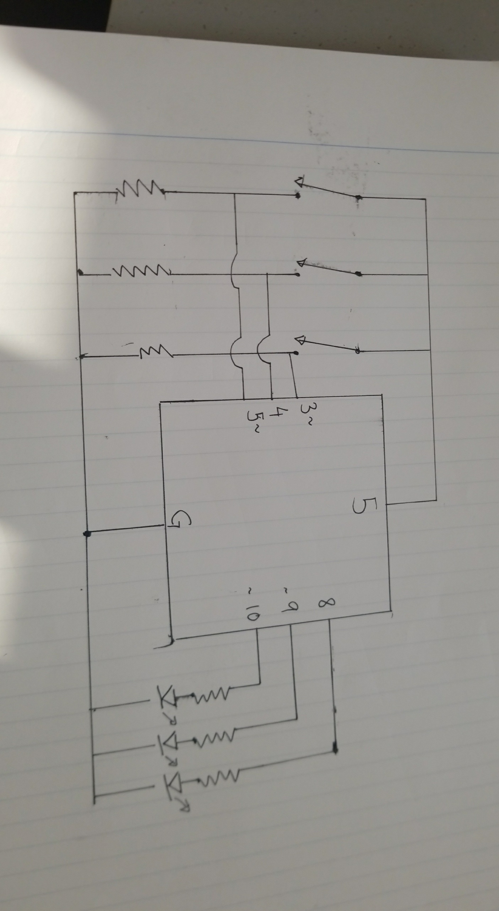

### PROCESS

The process became simple after revisiting the lecture and understanding exactly what DigitalReadSerial did since I didn't quite understand it in class. After that the execution of the puzzle was based on random decisions.

##### SCHEMATIC DIAGRAM

