##  PROJECT DESCRIPTION

I set out to create a simple car-like structure that had the capability to move, turn, stop, blink lights all while being remote controlled. However, my project morphed into creating a robot-like project that accomplishes all the above while also having a voice feature, automatic stopping when it encounters obstacles that serves the primary purpose of letting user know whether or not the lights in different areas are turned on or off.

The inspiration behind this project was a personal struggle to determine whether or not my bathroom lights were switched off once I had already gotten into bed. I often wished my bathroom could talk and let me know so I wouldn’t have to waste a trip to the bathroom only to find that I had actually remembered to turn off these lights.
The project was also intentioned to have simplistic user experience that mimicked elements of being futuristic despite its very basic composition. This implied carefully thought out aesthetic choices in colors, layouts, and fonts.

##  PROCESS
The process of creating my project involved three key parts: Building the exterior of the project, coding the project to function, and designing the user-project interface.
In the building of the exterior I used cardboard boxes. I used a measured, flat piece of cardboard layered with another piece of cardboard to create a sturdy body. For movement I made use of four motors and four wheels while for navigation I decided to use my phone’s camera as a webcam perched at the front of the robot-like machine by means of a cardboard carrier connected to the front end of the cardboard body. I used glue tacks and duct tape to attach all these parts together often using duct tape for cardboard-cardboard attachment and the glue tacks for cardboard-non cardboard attachment. The measurements of the cardboard body took into consideration the lengths of the wires connecting the motors to the Arduino as well as the size and weight of both the Arduino board and the breadboard that would be mounted on top of it.

Coding the project to function involved incorporating movement to the physical structure of the project.  Did this by coding in Arduino for there to be regulated power transferred to the motors and coded in Processing so that the direction and the power supply to these motors that caused movement were controlled by the arrow keys. I then connected a sonar sensor that would give information to processing concerning the distance between the robot and a surface when it was backing up. The Processing code stopped the motion of the robot if anything was less that 8cm behind it. I also coded the communication of the readings from the light dependent resistor to Processing so that Processing would give the user an audio confirmation whenever the robot entered a room with the lights on.

The user-project interface designing was intended to create a polished feel that still lookd fun. To accomplish this, I chose a neon colored background with a mixture of purple and pink. I also included recorded tracks of myself narrating in a funny robot voice the stages that the user is entering in with every button that they press. All these elements came together to create a very fun feeling interface that still communicates actual design effort that had a futuristic theme in mind. 

##  SCHEMATIC

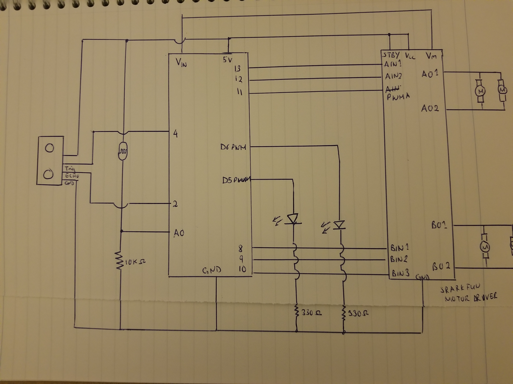

##  PICTURES OF PROGRAM LAYOUT 
#  Landing page

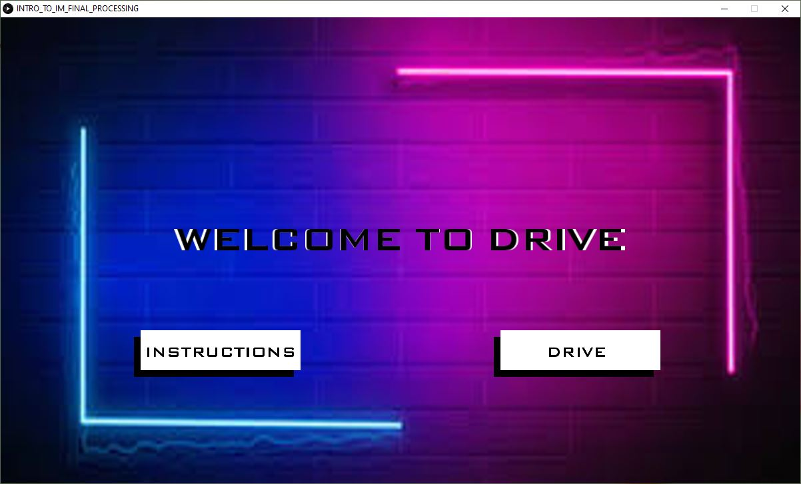

#  Instructions page

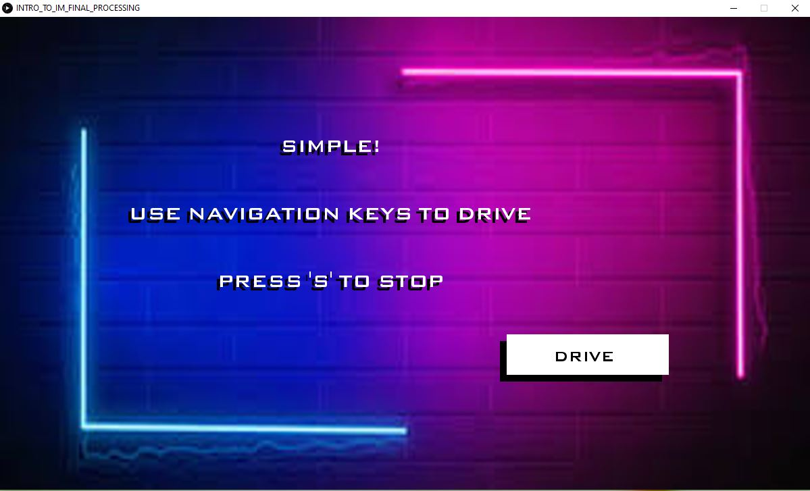

#  Drive Page

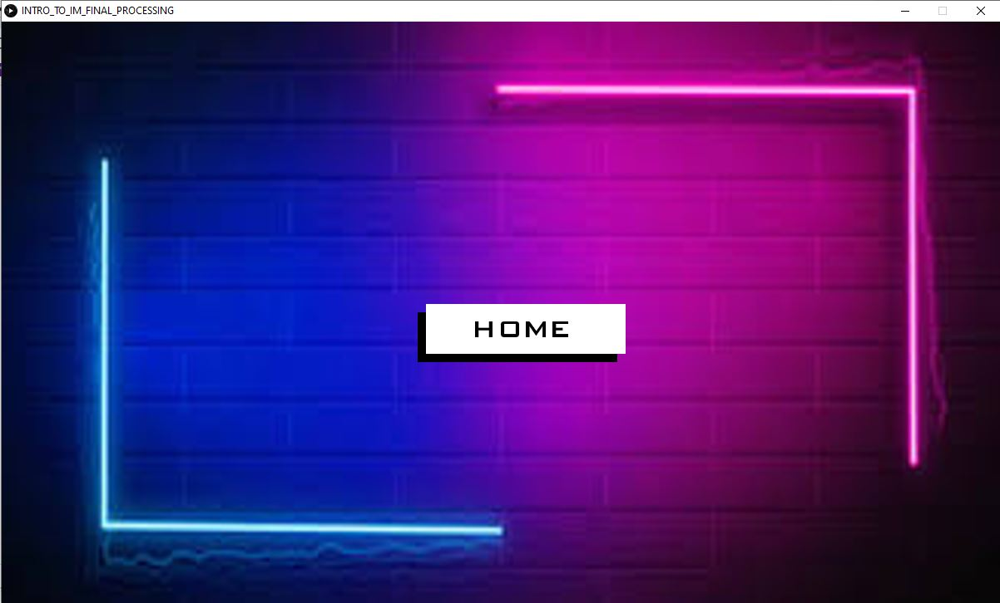

##  PICTURES OF PROJECT

#   Front view

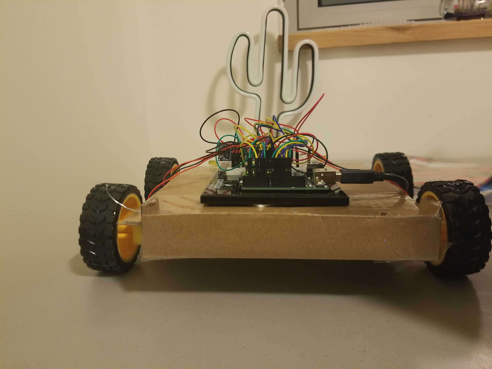

#  Back View

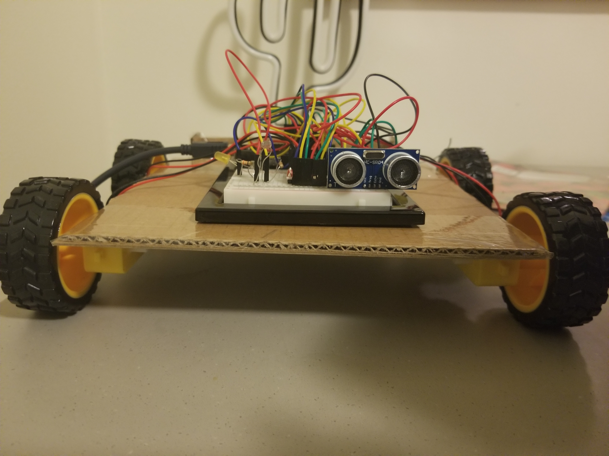

#  Top View

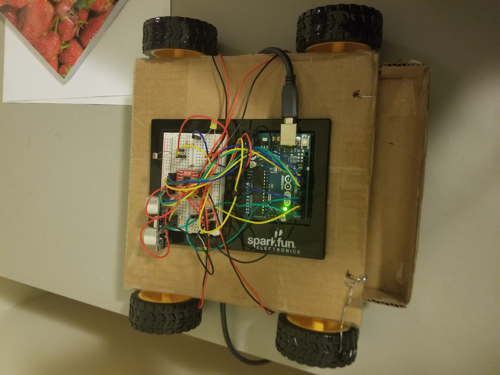

#  Bottom View

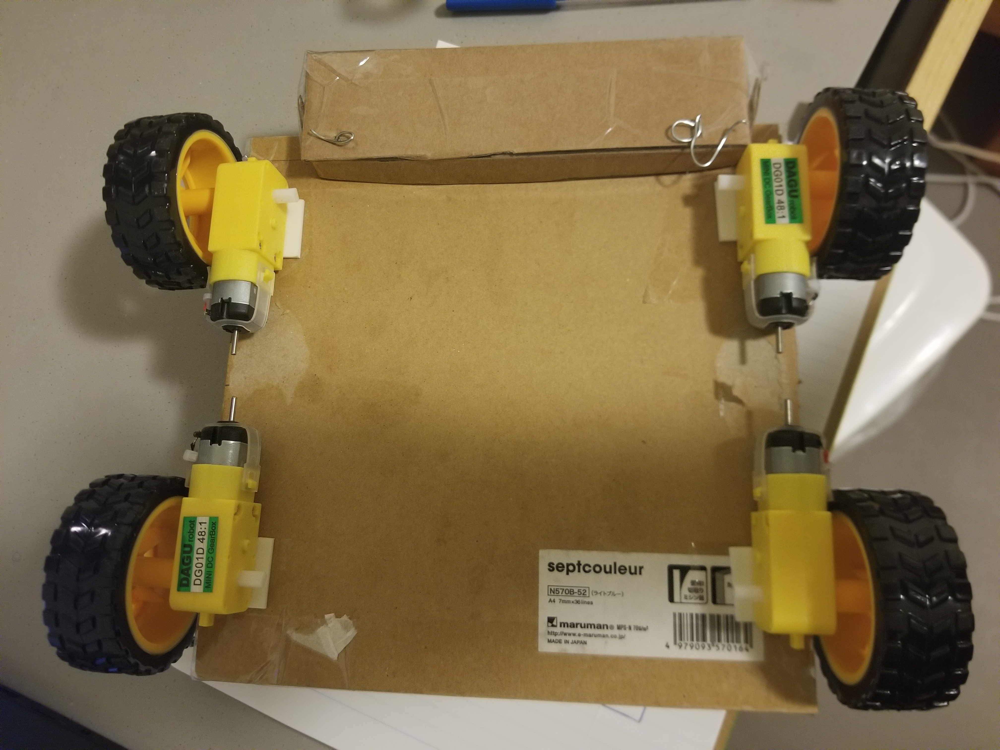

#  Side View

#  Light Sensitive Resistor

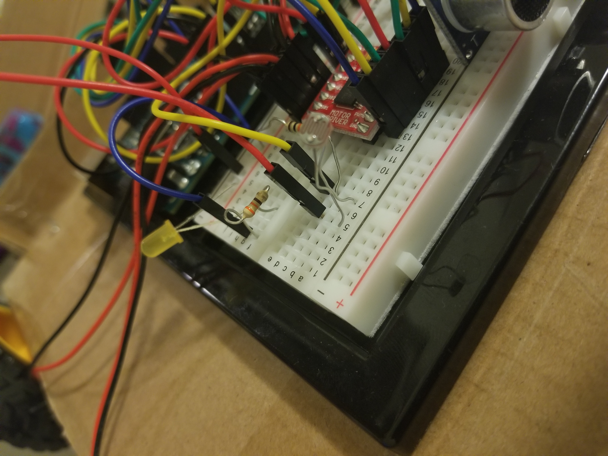

#  Sonar Sensor

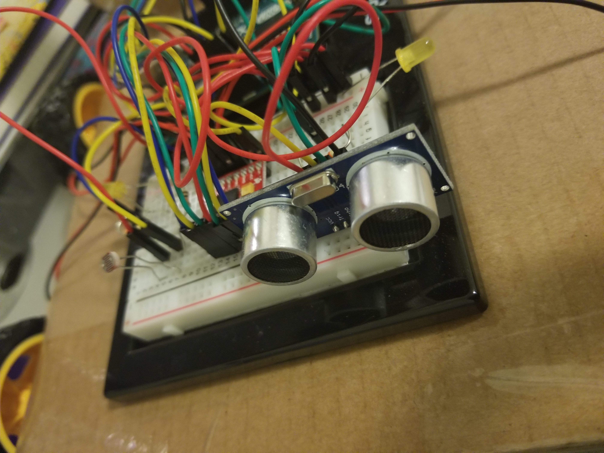

##  DIFFICULTIES

The biggest difficulty I encountered was coding without using delay(). I had to incorporate millis() when coding the blinker as well as when setting up the sonar sensor. Although I managed to do the code for the blinker, the code for the sonar remained challenging and I had to consult many posts on stack overflow to finally figure this out.
Another difficulty was that sometimes information would fail to be sent to Processing and Processing would just register an error. I found that reuploading the code on Arduino whenever this error happened temporarily solved the problem but I could never figure out why it happened to begin with.

##  CLEVER/DIFFICULT THINGS ABOUT MY PROJECT

The cleverest thing about my project is the fact that the carrier in front is made out of coat hangers that are lined with cardboard boxes for sturdiness and aesthetic.
# Photos of the carrier

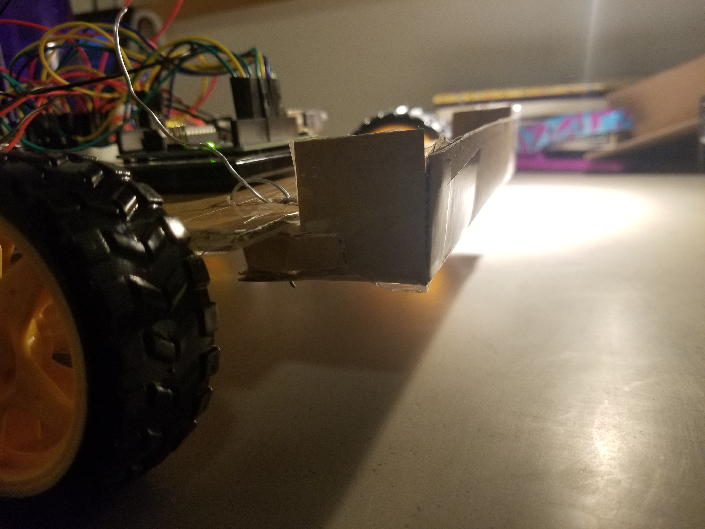

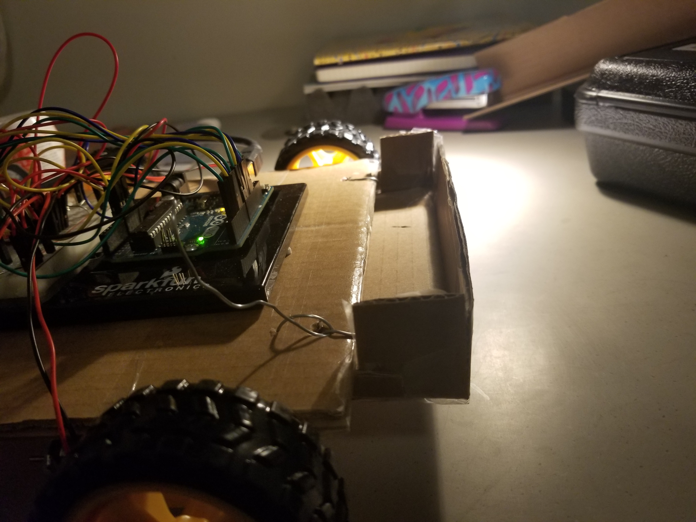

Also, the fact that I used my phone as a server that displays live video of the robot’s position is quite clever. I found an app called IP webcam that feeds the program an IP address on which the live video is being played. I coded the Processing code so that when the user clicks the “DRIVE” BUTTON, this IP address is automatically launched in the default browser.

##  VIDEO OF THE PROJECT WORKING

[Video1]( https://drive.google.com/file/d/1GXZ9DjmbcBr8-u9ti91n46zHJ4aq6chz/view?usp=sharing)
[Video2]( https://drive.google.com/file/d/1oHEvDSlwMgTA6vqtdE67bYn72Cra9381/view?usp=sharing)

