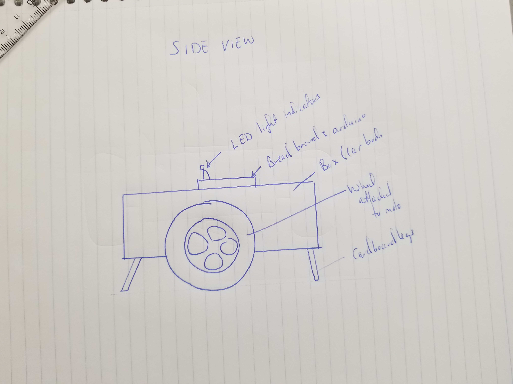
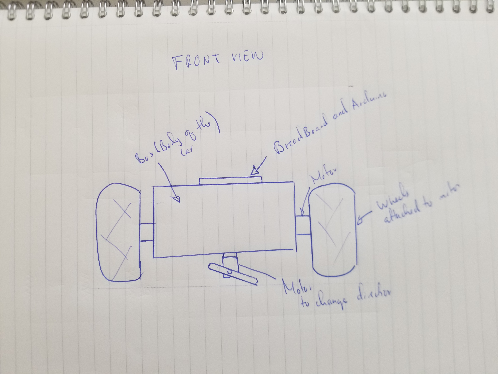

## PROJECT IDEA

I am planning on building a minuature car complete with the ability to turn around corners, reverse, change speed, blink indicator lights, remote navigation, and honk with it's primary controls being executed by means of processing.

A simple sketch of what I intend for the car to look like can be seen below.

## SKETCH OF THE CAR

## INTENDED PROCESS
As it stands now,I am planning to use a series of boxes for the body, LED lights for the blinkers, the larger motors for the wheels, to use the smalller motor to turn corners, and my cellphone camera as the car's camera that I will use for remote navigation.

I will link different controls for the car to different keyboard buttons. The enter button being the start and stop button, and the arrow keys controlling the direction of the car.

The trickiest parts, I expect, will be execution of the turning of the car and balancing everything ontop of the car seeing as I only have two wheels. I expect to find a way around this by providing the car with extra supports on either ends by means of glued on cardboard strips or sticks. The turning of the car using the smaller motor I expect to accomplish by attaching the smaller motor with its longer rotor to the bottom of the car in such a way that when a turn is comanded, the rotor will turn, come into contact with the ground in such a way that it lifts the car off the ground and orients it in a slightly different direction as intended.
